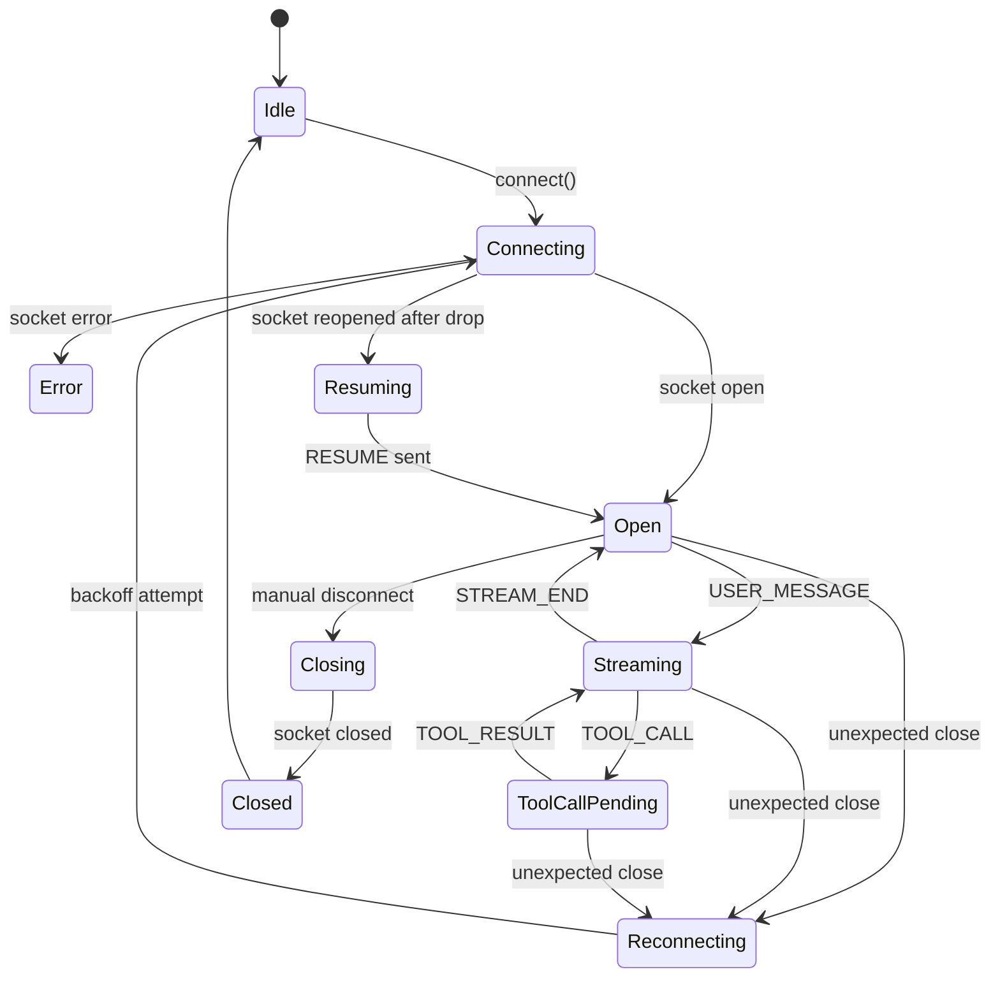
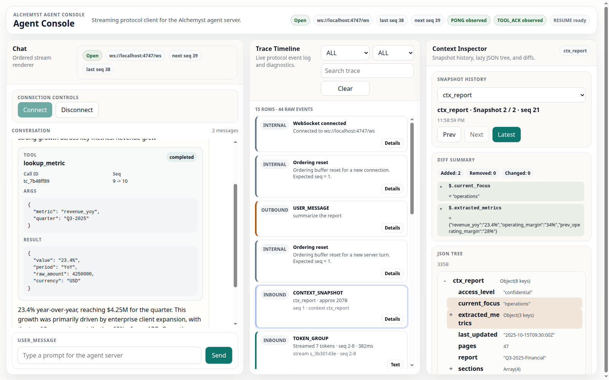
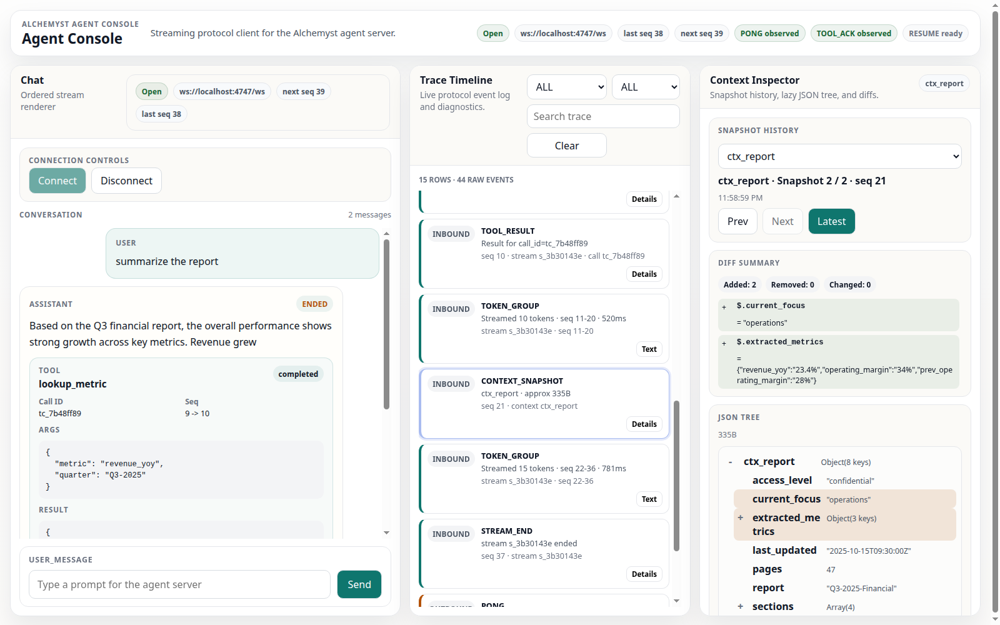
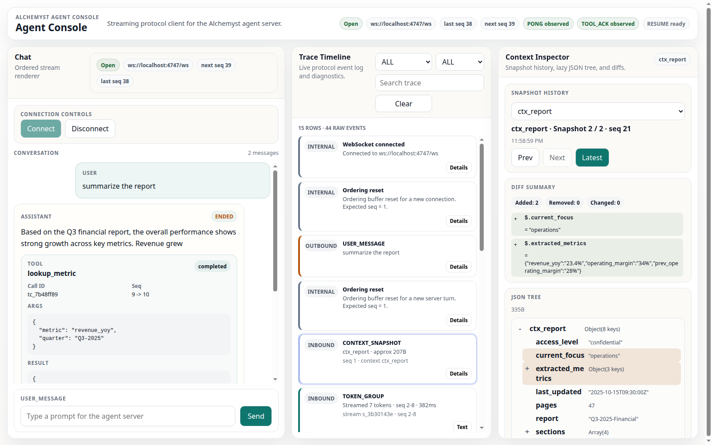

# Agent Console — Full Stack AI Engineer Assignment

## Summary
This project implements an Agent Console for the provided mock AI agent backend using a Next.js 14+ App Router frontend, strict TypeScript, and the browser WebSocket API. The UI treats the socket as an ordered protocol stream rather than a simple chat feed: inbound events are validated, reordered by `seq`, deduplicated, rendered incrementally, and recovered across reconnects with `RESUME`. The result is a frontend that supports streaming responses, mid-stream tool interruptions, a live trace timeline, a diffable context inspector, and practical chaos-mode recovery.

## Features Implemented
- [x] Streaming token renderer
- [x] Mid-stream tool call cards
- [x] Fast TOOL_ACK handling with dedupe
- [x] PING/PONG heartbeat handling, including empty challenge
- [x] Seq ordering buffer
- [x] Duplicate suppression
- [x] Reconnect with exponential backoff
- [x] RESUME-based state recovery
- [x] Trace timeline with grouped token rows
- [x] Timeline filtering/search
- [x] Tool call/result/ack linking
- [x] Context inspector
- [x] JSON diff engine
- [x] Lazy tree rendering for large context payloads
- [x] Pure-logic test coverage

## Architecture
Protocol pipeline:

```txt
WebSocketManager
  → safe JSON parser
  → protocol validator
  → fast protocol side effects: PONG / TOOL_ACK
  → seq ordering buffer
  → app store/reducers
  → derived selectors
  → chat / timeline / context panels
```

Key design choices:
- `PONG` is sent immediately from the raw validated `PING` path.
- `TOOL_ACK` is sent from the raw validated `TOOL_CALL` path to avoid chaos-mode ACK timeout behind seq gaps.
- Chat rendering still consumes only ordered events, so protocol speed does not break UI ordering.
- `RESUME` uses the highest fully processed seq, not the last raw received seq.
- On reconnect, the ordering buffer resets to `lastSeq + 1` so replay becomes authoritative.
- Large context payloads are diffed once on arrival and rendered through a lazy tree instead of eager full JSON dumps.

## WebSocket State Machine


Manual disconnect does not trigger reconnect. Unexpected close/error does.

## Protocol Compliance
### PING/PONG
- `PING` is handled immediately from the raw validated message path.
- Empty heartbeat challenges are echoed back as `""` instead of crashing or disconnecting.
- Backend `/log` verification showed `PONG` verdicts `ok`, including corrupt-heartbeat runs.

### TOOL_ACK
- `TOOL_ACK` is sent from the raw validated `TOOL_CALL` path and deduped by `call_id`.
- Ordered chat rendering still inserts the tool card later through the reducer, so the UI remains seq-correct.
- If a `TOOL_CALL` is received just as the socket dies, the ACK is queued and flushed immediately after reconnect/`RESUME`.

### RESUME
- `RESUME` is the first outbound message on reopened sockets.
- `last_seq` comes from the last fully processed ordered message, not the last raw inbound frame.
- Replay is processed through the same ordering and dedupe layer, so cards/text/context are stitched into existing state instead of duplicated.

### Ordering / dedupe
- `expectedSeq` tracks the next processable message.
- `buffer: Map<number, ServerMessage>` holds future out-of-order frames.
- `processedSeqs: Set<number>` suppresses duplicates and late replays.
- Buffered and duplicate cases are surfaced in the timeline as internal events instead of being silently dropped.

## Running Locally
### Install
```bash
npm install
```

### Build
```bash
npm run build
```

### Start production frontend
```bash
npm run start
```

### Dev frontend
```bash
npm run dev
```

No `.env` file is required. The frontend defaults to `ws://localhost:4747/ws`.

Optional override:

```env
NEXT_PUBLIC_AGENT_WS_URL=ws://localhost:4747/ws
```

## Running the Agent Server
### Normal mode
```bash
cd agent-server
docker build -t agent-server .
docker run -p 4747:4747 agent-server
```

### Chaos mode
```bash
docker run -p 4747:4747 agent-server --mode chaos
```

### Log check
```bash
curl -s http://localhost:4747/log | python3 -m json.tool
```

### Reset
```bash
curl http://localhost:4747/reset
```

## Running the Frontend
Run the frontend from the repository root:

```bash
npm run dev
```

Then open `http://localhost:3000` and connect the console to `ws://localhost:4747/ws`.

## Testing Normal Mode
Recommended prompts:

```txt
hello
summarize the report
analyze the correlation
find the SLA docs
show me the full database schema
write a long detailed document
```

What each prompt exercises:
- `hello`: basic streaming response and context initialization
- `summarize the report`: one tool call plus a context diff
- `analyze the correlation`: two sequential tool calls
- `find the SLA docs`: tool call before any assistant text
- `show me the full database schema`: large `CONTEXT_SNAPSHOT` payload
- `write a long detailed document`: long stream and reconnect candidate

## Testing Chaos Mode
Run the backend with `--mode chaos` and repeat these prompts:

```txt
write a long detailed document
analyze the correlation
show me the full database schema
summarize the report
find the SLA docs
```

The app is designed to tolerate:
- connection drop
- latency spike
- out-of-order delivery
- duplicate messages
- rapid tool calls
- corrupt heartbeat
- oversized context

What to watch in the UI:
- reconnect banner with attempt count
- outbound `RESUME` timeline row
- `BUFFERED` rows during out-of-order delivery
- `DUPLICATE_IGNORED` rows during replay/duplicates
- outbound `TOOL_ACK` rows and `TOOL_ACK_SKIPPED` when duplicates are suppressed
- grouped token rows instead of one row per token
- context inspector staying interactive during large snapshots

## Test Suite
Run:

```bash
npm test
npx tsc --noEmit
npm run build
```

Coverage areas:
- ordering buffer
- token grouping
- JSON diff
- reconnect backoff
- chat store/reducer
- active stream selector
- context state
- timeline selectors
- protocol validators

Current result: `66 tests passing`.

## Screenshots
### Streaming response with tool call


### Agent trace timeline


### Context inspector with diff


## Project Structure
```txt
src/
  app/          Next.js App Router entrypoints and global CSS
  components/
    chat/       Streaming chat UI, tool cards, input, banners
    context/    Context inspector, diff summary, lazy JSON tree
    layout/     Top-level shell and reusable panel wrappers
    timeline/   Trace timeline, grouped token rows, filters
  lib/
    context/    Context diffing and pure context state helpers
    protocol/   Protocol types, validators, builders, ordering buffer
    store/      Chat reducer and selectors
    timeline/   Token grouping and timeline selectors
    websocket/  Transport manager and reconnect backoff
```

## Known Limitations
- WebSocket lifecycle behavior is manually validated rather than covered by a browser WebSocket harness.
- The context tree is lazy-rendered in the browser; for multi-megabyte payloads, a worker-based diff/render pipeline would be preferable.
- The UI is optimized for assignment observability and protocol inspection rather than visual polish.

## Submission Notes
The demo vidoe is in the docs/recording
